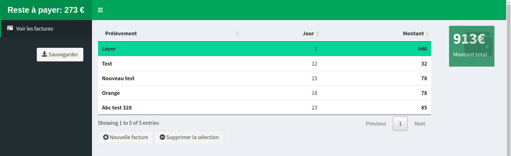

Application Shiny de suivi de comptes
================

## But de l’application

      Cette application a été développée afin de pouvoir avoir une
application simple de suivi de comptes accessible depuis n’importe quel
périphérique (PC, Téléphone, Tablette). Elle consiste à avoir une
interface simple de modification de tableau (d’autres onglets pourront
être rajoutés par la suite si besoin). L’interface ressemble à ceci :

## Fonctionnement de l’application

Vous pouvez avec cette application :

  - Ajouter de nouvelles lignes de facturation : *En cliquant sur
    “Nouvelle facture”, une nouvelle ligne apparaîtra avec des valeurs
    par défaut que vous pourrez modifier*

  - Modifier des lignes existantes : *Si vous double cliquez sur une
    valeur dans n’importe quelle colonne, vous pourrez alors la
    modifier*

  - Supprimer des lignes sélectionnées : *Vous pouvez sélectionnder des
    lignes en cliquant dessus, puis en cliquant sur “Supprimer la
    sélection”, les lignes sélectionnées seront supprimées*

**IMPORTANT : Une fois vos modifications supprimées, n’oubliez pas de
cliquer sur “Sauvegarder” pour que vos données soient conservées**

L’infobulle de total des factures et de reste à payer se mettront
automatiquement à jour en fonction des données que vous entrerez. La
coloration des lignes indique que le prélèvement est déjà passé et qu’il
n’est donc plus pris en compte dans le calcul du reste à payer.

## Disclaimer personnel

      Oui, il y a probablement 300 autres applications qui font ça en
mieux, oui le code peut certainement être amélioré, et non, je n’ai pas
fait d’école d’ingénieur ou de développeur. Je fais tout ça pour le fun,
car je voulais host cette application sur mon Raspberry Pi et que je
voulais essayer quelque chose qui me permette d’utiliser R, Github et
Docker, car je vais essayer d’en faire une image docker *(mais ça, c’est
un travail en cours)*.

Ce code est parfaitement libre, n’hésitez pas à le télécharger ou
modifier si vous le souhaitez. Il a été réalisé avec RStudio (v1.3.9013)
sous R v4.0.3 *(Bunny-Wunnies Freak Out)*.

## Installation

      Bien sûr, je décrirai ici la méthode d’installation de
l’application sur un système Linux (Debian ou Ubuntu), qui est bien
plus simple et plus directe que sur Windows (je ne sais pas si l’on peut
implémenter un serveur Shiny sous Windows).

### Prérequis

Voici la procédure pour installer l’application sur Ubuntu. Tout
d’abord, téléchargez R et Shiny :

> \# Installer R :
> <https://cran.r-project.org/bin/linux/ubuntu/README.html>   \#
> Installer Shiny :
> <https://rstudio.com/products/shiny/download-server/ubuntu/>

Ensuite, installez Git et configurez le :

> sudo apt-get install git-core   git config –global user.name “Your
> Name”   git config –global user.name
> “<your.email.address@mail.com>”

### Téléchargement et installation

Téléchargez le répertoire vers votre serveur Shiny

> sudo git clone <https://github.com/edaveau/shiny_comptes>
> /srv/shiny-server/shiny\_comptes

Installez ensuite le package *“renv”* dont vous aurez besoin pour
installer les dépendances.

> sudo su - -c “R -e "install.packages(‘renv’,
> repos=‘<https://cran.rstudio.com/>’)"”

Il ne vous reste plus qu’à activer *“renv”* pour installer les
dépendances :

> cd /srv/shiny-server/shiny\_comptes   sudo su - -c “R -e
> "renv::restore()"”

***A noter*** : *Pour télécharger les sources, R utilise curl,
assurez-vous donc que curl soit bien installé sur votre système.*

**Si vous allez ensuite sur l’URL suivante localhost:3838/shiny\_comptes
dans votre navigateur préféré, l’application sera disponible.**
